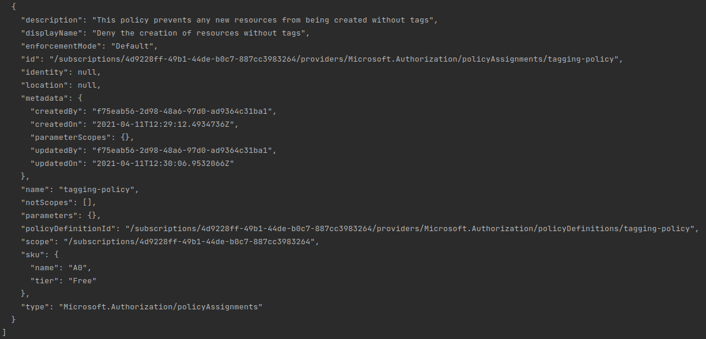

# Azure Policies
Deploying azure policies.

### Introduction
This readme contains instructions to deploy azure policies.

## Require Tag Name

This custom Azure Policy will deny a user from creating a resource if it does not include a specified tag name.

### Deploy with Azure CLI

To deploy this policy run the following commands from the current directory.

```cli
# Create the Policy Definition (Subscription scope)
az policy definition create --name tagging-policy --display-name "Deny the creation of resources without tags" --description "This policy prevents any new resources from being created without tags" --rules azurepolicy.rules.json --mode All

# Create the Policy Assignment
# Set the scope to a resource group; may also be a subscription or management group
az policy assignment create --name 'tagging-policy' --display-name "Deny the creation of resources without tags" --scope /subscriptions/<subscriptionId>/resourceGroups/<resourceGroupName> --policy /subscriptions/<subscriptionId>/providers/Microsoft.Authorization/policyDefinitions/tagging-policy
```
To view the assigned policy use the following command:
``` bash
    az policy assignment list
```
You should be able to see something like the screenshot below:

<p align="center">
  
</p>

### Delete with Azure CLI
```cli
# Delete the Policy Assignment
az policy assignment delete --name 'tagging-policy'

# Delete the Policy Definition
az policy definition delete --name tagging-policy
```
